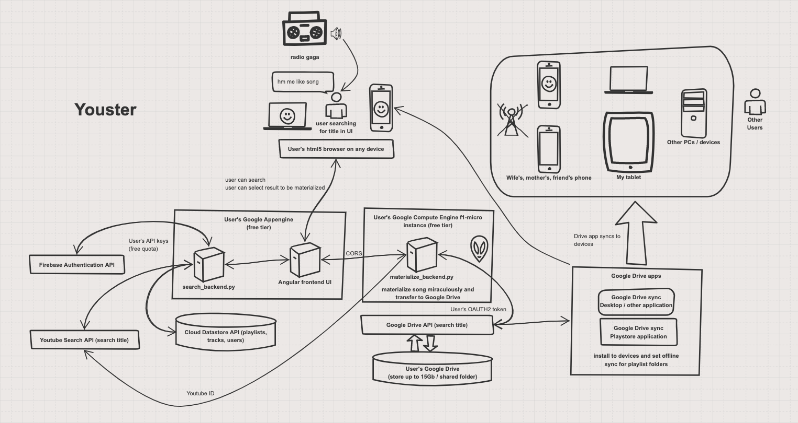

# Architecture of the app
https://sketchboard.me/xBEPu2JzScdM#/





GCP always free:
https://cloud.google.com/free/docs/gcp-free-tier

The program is split in to 3 parts:
- `donwload_backend.py`: runs on Google Compute Engine, api endpoint to download mp3 from Youtube and move files to Drive
- `search_backend.py` : runs on Google Appengine, returns Youtube search results and handles the UI, launches the download  
- `frontend` : Angular10 code for the UI, runs on Appengine 

# Launch local dev server
`dev_appserver.py app.yaml --enable_console`

- `dev_appserver.py` should exist in your path if the Google Cloud SDK is installed
- command should be executed in the folder where `app.yaml` is located

# Dependencies and required libraries 

### Frontend

Angular 10 :
npm install -g @angular/cli @angular/core

Need the libraries:
@angular/cdk @angular/http primeicons primeng rxjs-compat

Frontent is structured into components.  
Components are the most basic UI building block of an Angular app. An Angular app contains a tree of Angular components. Angular components are a subset of directives, always associated with a template. Unlike other directives, only one component can be instantiated for a given element in a template.(https://angular.io/api/core/Component)

### Drive Backend

This runs on the free 720 hours/month f1-micro vm of GCP (North America zone).

- the download backend will need : python3-pip, zip, unzip, wget apt packages
- install client libraries: `sudo pip3 install --upgrade google-api-python-client pafy youtube-dl oauth2client flask`
- need `pafy` for Youtube downloads

- need the cloud SDF : https://cloud.google.com/appengine/docs/standard/python/download
- Google drive api upload library : `from apiclient.http import MediaFileUpload`
- `pip install pyopenssl` for adhoc certs on download backend - this will be changed to Let's Encrypt

### Search backend required npm packages :

This will run together with the frontend on Appengine.

- npm install @angular/cdk @angular/http primeng primeicons rxjs-compat
- add Primeng CSS styles to the app's `angular.json`


# Add missing files
- In order to make the app functional, you have to add your `credentials.json` and `token.json` files into the folder where the download_backend.py is - these are used to as authentication for Google APIs 
- `token.json` can be created by removing old token file and running `python download_backend.py --noauth_local_webserver`
- also your Youtube API key is needed in the code


# TLDR; Build and deploy

Build the bundle.js, copy together into a folder with search_backend, use gcloud to deploy the app to Appengine.
`ng build && cp `
(I'll add an easy deploy method soon).

# Gcloud commands

```bash
# init gcloud environment, for ex. select username and project
gcloud init
gcloud config set account balassy.magor@gmail.com
gcloud auth login
gcloud config set project youster
gcloud compute --project "youster" ssh --zone "us-east1-b" "gc"
gcloud compute scp ../youster.tar.gz  balassy_magor@gc:~/
gcloud compute scp [LOCAL_FILE_PATH] [INSTANCE_NAME]:~/
gcloud app browse

```


# Errors

ImportError: ctypes is currently disabled on this App Engine app; to enable it, add GAE_USE_CTYPES: '1' to the env_variables section of your app.yaml file (We don't need this actually).

# App deployment

```bash
magor@ubuntu-vm:~/Documents/SynologyDrive/youster$ gcloud app deploy app.yaml 
You are creating an app for project [playlis].
WARNING: Creating an App Engine application for a project is irreversible and the region
cannot be changed. More information about regions is at
<https://cloud.google.com/appengine/docs/locations>.

Please choose the region where you want your App Engine application 
located:

 [1] asia-east2    (supports standard and flexible)
 [2] asia-northeast1 (supports standard and flexible)
 [3] asia-northeast2 (supports standard and flexible)
 [4] asia-south1   (supports standard and flexible)
 [5] australia-southeast1 (supports standard and flexible)
 [6] europe-west   (supports standard and flexible)
 [7] europe-west2  (supports standard and flexible)
 [8] europe-west3  (supports standard and flexible)
 [9] europe-west6  (supports standard and flexible)
 [10] northamerica-northeast1 (supports standard and flexible)
 [11] southamerica-east1 (supports standard and flexible)
 [12] us-central    (supports standard and flexible)
 [13] us-east1      (supports standard and flexible)
 [14] us-east4      (supports standard and flexible)
 [15] us-west2      (supports standard and flexible)
 [16] cancel
Please enter your numeric choice:  8

Creating App Engine application in project [youster] and region [europe-west3]....done.                                                         
Services to deploy:

descriptor:      [/home/magor/Documents/SynologyDrive/youster/app.yaml]
source:          [/home/magor/Documents/SynologyDrive/youster]
target project:  [youster]
target service:  [default]
target version:  [20190623t173749]
target url:      [https://youster.appspot.com]


Do you want to continue (Y/n)?  y

Beginning deployment of service [default]...
╔════════════════════════════════════════════════════════════╗
╠═ Uploading 1295 files to Google Cloud Storage             ═╣
╚════════════════════════════════════════════════════════════╝
File upload done.
Updating service [default]...done.                                                                                                              
Setting traffic split for service [default]...done.                                                                                             
Deployed service [default] to [https://youster.appspot.com]

You can stream logs from the command line by running:
  $ gcloud app logs tail -s default

To view your application in the web browser run:
  $ gcloud app browse
```

